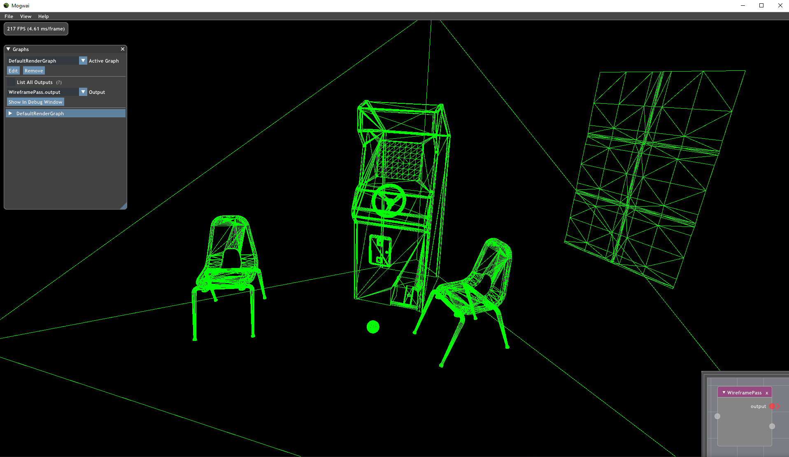

### [Index](../index.md) | [Tutorials](./index.md) | Writing Shaders

--------

# Writing Shaders

Now that we've written a basic render pass and render graph, let's look at writing more complex passes that use shaders. Falcor uses the Slang shading language and compiler, and files should use one of the following extensions: `.slang`, `.slangh`, `.hlsl`, `.hlsli`. For more information on best practices for working with shaders in Falcor, please refer to the *Using Shaders and Data Files* section of the [Getting Started](../Getting-Started.md) page.

For this tutorial, we'll create a pass that renders a scene as a wireframe of a particular color.

## Writing a Simple Shader
Our shader for this example will be a simple one line pixel shader that we can pass a color to, which will return that color as the color for each pixel. For this, we will need a constant buffer containing our color input as well as a function that returns this input.

```c++
cbuffer PerFrameCB
{
    float4 gColor;
};

float4 main() : SV_TARGET
{
    return gColor;
}
```

Note that we are not specifying a register or space here. This is not required as bind locations for shader resources are automatically allocated by Slang, and Falcor allows you to reference these resources by name. However, manual assignment is still supported if needed.

## Creating the `WireframePass`
Set up the pass as described in Tutorial 3 and add the shader file to the project. `reflect()` will need to return a `RenderPassReflection` containing a single output field, and change all descriptions to "Renders a scene as a wireframe". We will also need to add the following private variables to the class:

```c++
Scene::SharedPtr mpScene;
GraphicsProgram::SharedPtr mpProgram;
GraphicsState::SharedPtr mpGraphicsState;
RasterizerState::SharedPtr mpRasterState;
GraphicsVars::SharedPtr mpVars;
```

Let's take a look at the other functions, most of which will be more complex than in `ExampleBlitPass`.

### `WireframePass()`
While `create()` does not need to do more than calling the constructor and returning the result wrapped in a `SharedPtr`, we will need to initialize these objects in the constructor:
- `GraphicsProgram::SharedPtr mpProgram` - Initialize this by calling `GraphicsProgram::createFromFile()` with the filename and names of the vertex and pixel shader functions within the shader's code.
- `RasterizerState::SharedPtr mpRasterState` - For our example, we want the `FillMode` to be `Wireframe` and the `CullMode` to be `None`. To do this, first create a `RasterizerState::Desc` then use `setFillMode()` and `setCullMode()` to set these values. Then, create the `RasterizerState` object by calling `RasterizerState::create()` with the `Desc` object as an argument.
- `GraphicsState::SharedPtr mpGraphicsState` - We can create a new `GraphicsState` by calling `GraphicsState::create()` and bind `mpProgram` and `mpRasterState` by calling `setProgram()` and `setRasterizerState()` on it.

The constructor should look similar to this:
```c++
WireframePass::WireframePass()
{
    mpProgram = GraphicsProgram::createFromFile("RenderPasses/WireframePass/Wireframe.ps.slang", "", "main");

    RasterizerState::Desc wireframeDesc;
    wireframeDesc.setFillMode(RasterizerState::FillMode::Wireframe);
    wireframeDesc.setCullMode(RasterizerState::CullMode::None);
    mpRasterState = RasterizerState::create(wireframeDesc);

    mpGraphicsState = GraphicsState::create();
    mpGraphicsState->setProgram(mpProgram);
    mpGraphicsState->setRasterizerState(mpRasterState);
}
```

### `setScene()`
Our first render pass had no need for a `Scene` object; however, this pass does and will need this function to set `mpScene`. We first need to set `mpScene` to the scene that's passed in then add all scene defines to `mpProgram`. We then create our `GraphicsVars` so that we can bind shader variables later in `execute()`. These are done like so:
```c++
void WireframePass::setScene(RenderContext* pRenderContext, const Scene::SharedPtr& pScene)
{
    mpScene = pScene;
    if (mpScene) mpProgram->addDefines(mpScene->getSceneDefines());
    mpVars = GraphicsVars::create(mpProgram->getReflector());
}
```
#### Why scene defines?
We need some way to tell Slang/HLSL exactly how many resources the scene needs to bind and need to ensure that this scene data is portable between shaders. However, there's currently no way to do this automatically, so we use scene defines to communicate this information.

### `execute()`
This function will need to perform several operations: create and bind an FBO for our output to the `GraphicsState`, set the render state, and render our scene by calling `Scene::render()`.

#### Creating and Binding the FBO
We can create and bind an FBO for our renderer to render to by first calling `Fbo::create()` on our output texture, clearing it to remove any data from previous executions (preventing it from leaving permanent trails if you try to move the camera), and calling `GraphicsState::setFbo()` to bind it. This step looks like this:
```c++
auto pTargetFbo = Fbo::create({ renderData["output"]->asTexture() });
const float4 clearColor(0, 0, 0, 1);
pRenderContext->clearFbo(pTargetFbo.get(), clearColor, 1.0f, 0, FboAttachmentType::All);
mpGraphicsState->setFbo(pTargetFbo);
```

#### Setting the Render State
We need to perform two operations here: indicate that we want to use a custom `RasterizerState` and bind all necessary values to our shader. We can indicate that we're using a custom `RasterizerState` by creating a `Scene::Renderflags` object and setting the flag `Scene::RenderFlags::UserRasterizerState`. Binding shader values is also fairly straightforward as Falcor allows you to set shader values in the `GraphicsVars` object in the same way as you would set values in an array. Our shader requires a single color value, `gColor`, which is located inside the `perFrameCB` constant buffer. This step should look like this:
```c++
Scene::RenderFlags renderFlags = Scene::RenderFlags::UserRasterizerState;
mpVars["perFrameCB"]["gColor"] = float4(0, 1, 0, 1);
```

#### Rendering a Scene Using the Shader
With our scene, shader, and both the `GraphicsState` and `RasterizerState` set up, we can finally render our scene at the end of `execute()`. This is done through the `render()` method of `mpScene`, like so:
```c++
mpScene->render(pRenderContext, mpGraphicsState.get(), mpGraphicsVars.get(), renderFlags);
```
Your `execute()` function should now look like this, with a check for `mpScene` so we avoid accessing the scene when it isn't set:
```c++
void WireframePass::execute(RenderContext* pRenderContext, const RenderData& renderData)
{
    auto pTargetFbo = Fbo::create({ renderData["output"]->asTexture() });
    const float4 clearColor(0, 0, 0, 1);
    pRenderContext->clearFbo(pTargetFbo.get(), clearColor, 1.0f, 0, FboAttachmentType::All);
    mpGraphicsState->setFbo(pTargetFbo);

    if (mpScene)
    {
        // Set render state
        Scene::RenderFlags renderFlags = Scene::RenderFlags::UserRasterizerState;
        mpVars["PerFrameCB"]["gColor"] = float4(0, 1, 0, 1);

        mpScene->render(pRenderContext, mpGraphicsState.get(), mpVars.get(), renderFlags);
    }
}
```

Using the Render Graph Editor, create a graph solely containing this pass then launch it in Mogwai. You should see a black screen as there is no scene currently loaded. Load a scene by going to `File -> Load Scene`, and you should now see the wireframe for the scene you selected. We used Arcade.fscene (located in the `Media` folder), which looks like this:


