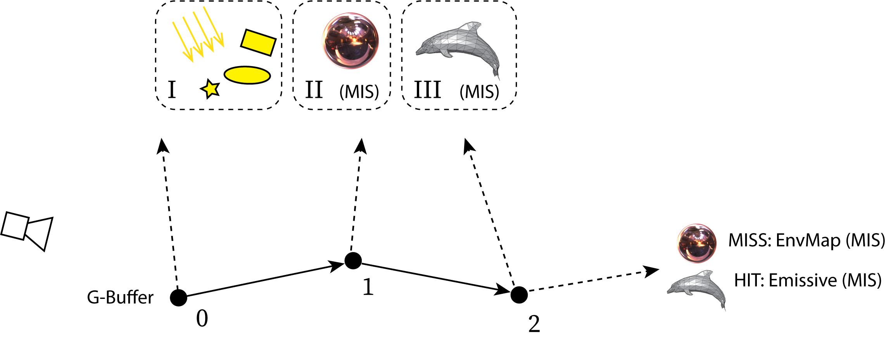
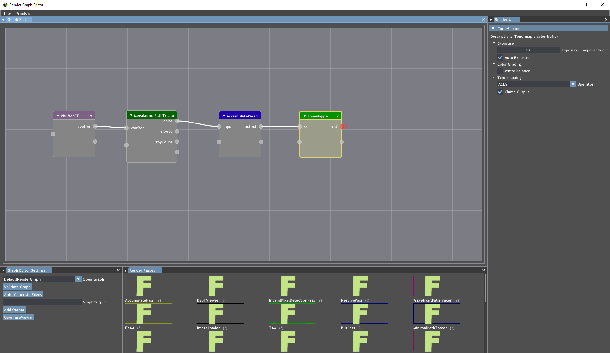
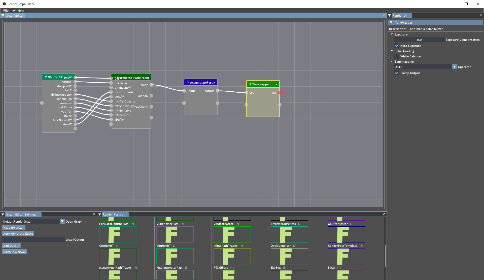

### [Index](../index.md) | [Usage](./index.md) | Path Tracer

--------

# Path Tracer

## Getting Started

1. Install NVAPI according to the instructions in the README
2. Build the Falcor solution
3. Launch Mogwai
4. The sample Path Tracer render graph file is located at `Source/Mogwai/Data/PathTracer.py`. You can load it using one of the following methods:
    - From the top menu bar, click `Load Script`, then navigate to `PathTracer.py`.
    - Press `Ctrl + O`, then navigate to `PathTracer.py`.
    - Drag and drop  `PathTracer.py` into the application window.
    - Load at startup using the Mogwai `--script` command line option.
5. Load a model or scene using one of the following methods. A sample scene is included, located at `Media/Arcade/Arcade.fscene`. Falcor can also load any format supported by Assimp.
    - From the top menu bar, click `Load Scene`, then select a file.
    - Press `Ctrl + Shift + O` then select a file.
    - Drag and drop a file into the application window.

## Overview

The `MegakernelPathTracer` render pass implements an unbiased path tracer in DXR 1.0. Paths are created in a raygen shader and hit/miss points are reported back from the respective shader stages. The raygen shader loops over path segments up to the maximum configured path length.

For each pixel on screen, `samplesPerPixel` paths are traced.
At each path vertex (black dots), a configurable number `lightSamplesPerVertex` of shadow rays (dashed lines) is traced to sampled light sources. 

The sampling of a light is done by first randomly selecting one of up to three light sampling strategies (I: analytic lights, II: env map, III: mesh lights), followed by importance sampling using the chosen strategy. For (II) and (III), multiple importance sampling (MIS) is used.

If `maxBounces` is set to zero, only direct illumination is evaluated. If it is one, then 1-bounce indirect is returned, etc. In the example, `maxBounces = 2`.

Note that at the last vertex, if the scene has emissive lights and/or MIS is enabled, a last ray is traced using BSDF sampling to avoid missing any direct illumination contribution to the last path vertex.

## Configuration

### Inputs

The path tracer can take either a G-buffer as input, where all geometric/material parameters are stored per pixel, or it can take a lightweight V-buffer as input. The V-buffer encodes just the hit mesh/primitive index and barycentrics. Based on those attributes, the path tracer fetches vertex and material data.

The V-buffer input is the default. It is configured using a parameter `useVBuffer=1` in the config file. If setting the value to `0` then a G-buffer is assumed instead. This parameter cannot be changed at runtime, it can only be set through the render script.

When configured to use G-buffer input:

- `tangentW` is optional and only really needed for anisotropic materials (not supported yet) or if consistent tangent frames are needed. If not connected, a tangent frame is created based on the normal.
- `viewW` is optional but needed for correct shading with depth-of-field (otherwise the view direction points towards the camera origin, instead of the actual lens sample position).
- `vbuffer` is optional but needed for correct shading with dielectrics (glass), as the renderer fetches the material ID from this input.
- All other inputs are required.

### Outputs

- All outputs are optional.
- Only outputs that are connected are computed.
- The `rayCount` is a fullscreen 32-bit uint buffer storing number of rays traced per pixel for debugging/visualization purposes.
- The `pathLength` is a fullscreen 32-bit uint buffer storing the path length per pixel for debugging/visualization purposes.
- The `time` output is a fullscreen 32-bit uint buffer with GPU execution time per pixel (requires NVAPI).

### Example: Progressive path tracer in the render graph editor

**V-buffer input**

**G-buffer input**

## Sampling strategies

Note: Multiple importance sampling is applied to the strategies marked MIS.

### BSDF sampling (MIS)

- Disney isotropic diffuse.
- Trowbridge-Reitz GGX specular reflection/transmission with VNDF sampling.
- Diffuse/specular reflection or transmission is chosen stochastically.

### Environment map sampling (MIS)

- A hierarchical importance map (mipmap) is computed at startup.
- Importance sampling by hierarchical warping of 2D uniform number.
- The PDF is proportional to incoming radiance, ignoring cosine term and visiblity.

### Emissive meshes light sampling (MIS)

- A light BVH is built over all emissive triangles.
- The per-triangle flux is pre-integrated and zero emissive triangles culled.
- Hierarchical importance sampling (see the book "Ray Tracing Gems", chapter 18).
- There is an optional uniform light sampling mode.

### Analytic light sampling

- Used for point, directional, distant, and quad/disc/sphere area lights.
- Lights are specified in the FBX file (point, directional) or Python scene file (.pyscene).
- Each light source is selected with equal probability.

## Validation/debugging tools

### MinimalPathTracer

- Separate `MinimalPathTracer` pass.
- Naive/simple to be easy to verify, no importance sampling or MIS etc.
- Produces ground truth images (but converges slowly).
- Does not support transmission or nested dielectric materials yet.

### ErrorMeasurePass

- Takes a source image and a reference image.
- The reference can either be loaded from disk, or taken from a pass input.
- Makes it possible to run two separate configs in parallel, compare their output.

### Shader print/assert

- The `MegakernelPathTracer` pass supports debugging with `print()` in the shader.
- Click *Pixel Debug* in the UI to enable, click on a pixel to show it's output.
- It's useful to freeze the random seed (UI option) to avoid flickering values.
- There is also an `assert()` call that prints the coordinates of triggered asserts in the UI.
