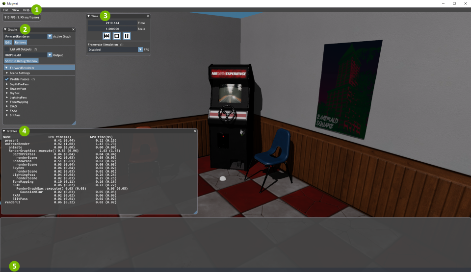

### [Index](../index.md) | [Tutorials](./index.md) | Mogwai Usage

--------

# Mogwai Usage

## Building Mogwai

In Visual Studio:
1. Setup the Visual Studio solution (see main README).
2. From the top menu bar, select `Build` -> `Build Solution`, and wait for compilation to complete
3. The executable will be `build/<preset name>/bin/[Debug|Release]/Mogwai.exe`

## Running Mogwai

Run Mogwai from within Visual Studio (by pressing Ctrl+F5), or from the command prompt using:

```
  Mogwai {OPTIONS}

    Mogwai render application.

  OPTIONS:

      -h, --help                        Display this help menu.
      -s[path], --script=[path]         Python script file to run.
      -S[path], --scene=[path]          Scene file (for example, a .pyscene
                                        file) to open.
      -l[path], --logfile=[path]        File to write log into.
      -v[verbosity],
      --verbosity=[verbosity]           Logging verbosity (0=disabled, 1=fatal
                                        errors, 2=errors, 3=warnings, 4=infos,
                                        5=debugging)
      --silent                          Starts Mogwai with a minimized window
                                        and disables mouse/keyboard input as
                                        well as error message dialogs.
      --width=[pixels]                  Initial window width.
      --height=[pixels]                 Initial window height.
      -c, --use-cache                   Use scene cache to improve scene load
                                        times.
      --rebuild-cache                   Rebuild the scene cache.
      -d, --debug-shaders               Generate shader debug info.
      --enable-debug-layer              Enable debug layer (enabled by default
                                        in Debug build).
```

Using `--silent` together with `--script` allows to run Mogwai for rendering in the background.

If you start it without specifying any options, Mogwai starts with a blank screen.

## Loading Scripts and Assets

With Mogwai up and running, we'll proceed to loading something. You can load two kinds of files: scripts (which usually contain some global settings and render graphs) and scenes.

### Loading a Script (.py)
Open the load script dialog by either going to `File -> Load Script` or hitting `Ctrl + O`. Navigate to the location of the script you wish to run and select it to load and run it. Alternatively, dragging-and-dropping a script into Mogwai will also work. Note that scripts intended for use with Mogwai must be written in Python. Full scripting documentation can be found [here](../Usage/Scripting.md).

Here, we'll load the Forward Renderer, located at `Source/Mogwai/Data/ForwardRenderer.py`.

### Loading a Scene
Mogwai loads the scene specified by the script, if any. If the script did not load a scene or you want to load a different scene, open the load scene dialog by either going to `File` -> `Load Scene` or hitting `Ctrl + Shift + O`. Navigate to the location of the scene file you wish to load and select it. Alternatively, you can also drag-and-drop scene files into Mogwai.

A sample Arcade scene is included, which can be found at `media/Arcade/Arcade.pyscene`.

## Mogwai UI
Once you have a script (and optionally, a scene) loaded, you should see something similar to



Major UI elements:

1. Main Menu - Of note, `Save Config` under `File` will save your current graph and app settings to a script. Otherwise, the main menu generally contains toggles for various UI elements as well as a help window for controls.
2. Graphs UI - This is where you'll be able to change the active graph as well as modify scene and pass-specific settings. You can also select which pass output to display here. Any changes made are reflected in real-time.
3. Time UI - These controls allow you to control the time/frame the scene is on. Pausing will pause all animations in the scene. Note that the renderer is unaffected and must be paused manually by using the keyboard shortcut.
4. Profiler - This will only be present if the profiler is enabled.
5. Console - Hidden by default, this will allow you to edit the currently active graph's settings in real-time through Python scripting.

## Mogwai Controls
The following is a list of available controls:

`F1` - Show the help message\
`F2` - Show/Hide the GUI\
`F6` - Show/Hide the graph controls\
`F9` - Show/Hide the time controls\
`F10` - Show/Hide FPS\
`F11` - Show/Hide the menu bar\
`` ` `` - Show/Hide the scripting console\
`P` - Enable/Disable profiling\
`Esc` - Quit

`Ctrl + O` - Load script\
`Ctrl + Shift + O` - Load scene\
`F5` - Reload shaders\
`V` - Toggle VSync\
`F12` - Capture screenshot\
`Shift + F12` - Capture video\
`Pause` or `Space` - Pause/Resume the global timer\
`Ctrl + Pause` or `Ctrl + Space` - Pause/Resume the renderer

`W, A, S, D, Q, E` - Move the camera\
`Left Click + Drag` - Rotate camera\
`Shift` - Speeds up camera movement when held down\
`Ctrl` - Slows down camera movement when held down\
`Z` - Magnify the currently hovered area\
`Mouse Wheel` - Change zoom level when magnifying a pixel
