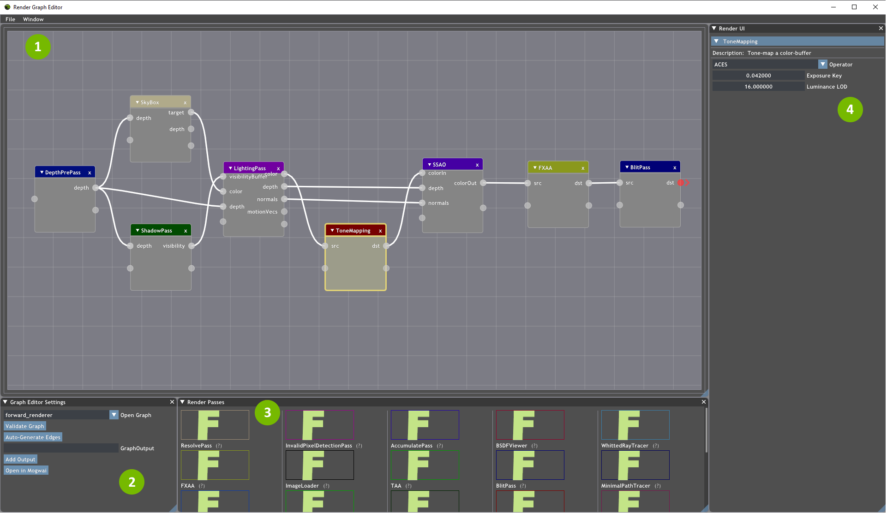
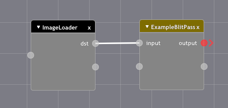
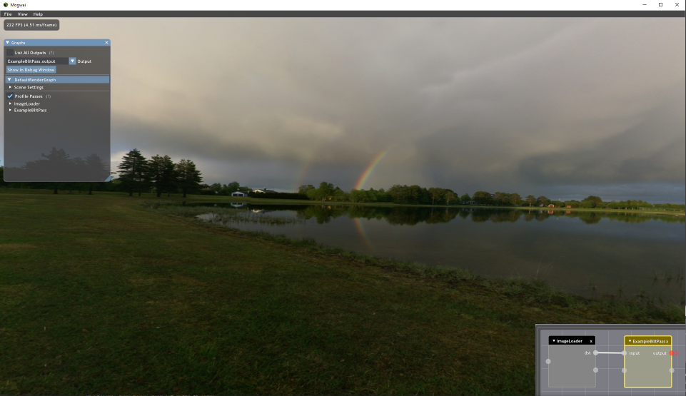
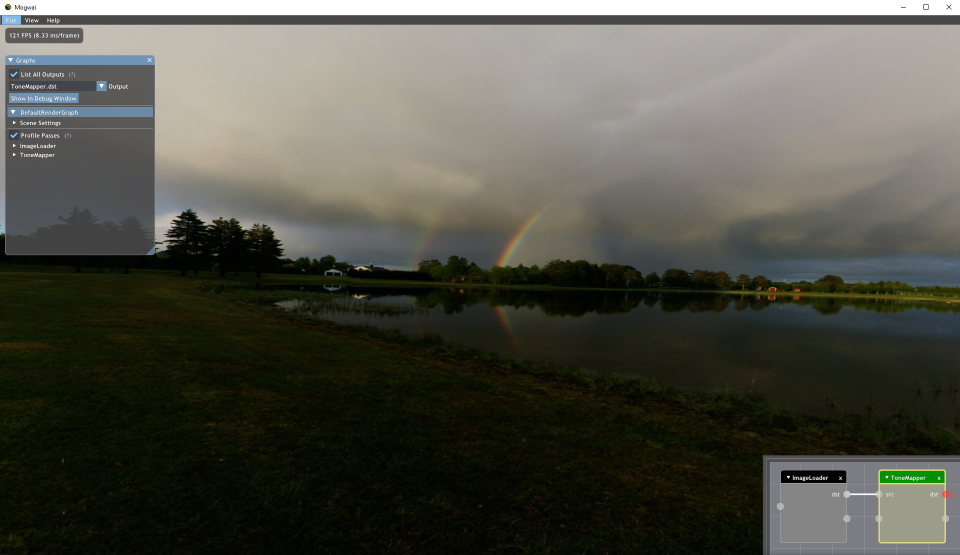

### [Index](../index.md) | [Tutorials](./index.md) | Creating and Editing Render Graphs

--------

# Creating and Editing Render Graphs

Now that we've written a simple render pass, we turn our attention to creating and editing render graphs. There are two methods of doing this: using the Render Graph Editor and using Python scripting. We will cover both in this tutorial though using the editor is recommended.

## Render Graph Editor
Set `RenderGraphEditor` as the startup project and launch it as you did Mogwai. You'll see a screen similar to this:



Major UI Elements:

1. Graph Editor - The main workspace. This is where you'll assemble passes to create a graph.
2. Graph Editor Settings - Allows you to select a different graph to view and edit. Most notably, the `Open in Mogwai` button lets you run your graph in Mogwai directly from the editor.
3. Render Passes - All available render passes are located here. Simply drag and drop into the graph editor to add them.
4. Render Pass UI - When a render pass is selected in the editor window, its UI-controllable settings will be displayed here.

### Creating Graphs
The general process for creating graphs using the editor is as follows:

1. Drag render passes from the Render Passes window to the graph editor pane.
2. Connect pass nodes with edges. There are two kinds of edges:
    - **Data dependency** - Edges that connect an output resource of one pass to an input resource of a different pass. These are represented as a line between the input/output pins of two different passes.
    - **Execution dependency** - Optional edges that are generally used for greater control over the execution order of a graph or to force a pass to run regardless of its impact on the graph's output. In the graph editor, these edges connect the execution pins of two different passes (the unlabeled pins for each pass).
3. Mark any outputs by hovering over the corresponding pin and checking `Graph Output` in the pop up. All render graphs are required to have at least one output.

As an example, we'll create a graph using the render pass `ExampleBlitPass` we wrote in the previous tutorial. To start, drag an `ImageLoader` and `ExampleBlitPass` into the graph editor pane and set an image for `ImageLoader` by clicking on it then selecting `Load Image` in the Render UI window. Then, connect the `ImageLoader` output labeled `dst` with the `ExampleBlitPass` input labeled `input` with an edge by clicking on the circle and dragging (be sure to click the outer half as clicking on the inner half current moves the pass' block around instead). Finally, hover over the `output` circle for `ExampleBlitPass` and check the `Graph Output` box, marking it as this graph's output. Your graph should look like this:



Clicking `Open in Mogwai` will then launch Mogwai and automatically load the currently active graph. If you did everything correctly, you should simply see the image you loaded in `ImageLoader` displayed on-screen.

### Editing Graphs Live
You can also directly edit a graph and have those changes reflected in real-time using the Render Graph Editor. To do this, start by launching the graph's script in Mogwai. Click the `Edit` button below the dropdown for selecting the active graph, which will launch the Render Graph Editor with the currently active graph loaded by default. Here is the graph we created above again with its render in Mogwai:



From here, you can modify a render pass' properties by clicking on the pass; its options will appear in the Render UI window to the right. In most cases, any change will be immediately reflected in Mogwai as long as the graph and selected output remain valid. If you are removing passes, make sure to first select an output in the Graph UI in Mogwai that will remain valid afterwards before making any changes. On the other hand, if you are adding passes and will be changing the graph's output, be aware that you will need to manually select the new output in Mogwai.

As an example, we'll modify our graph by removing `ExampleBlitPass` and adding a `ToneMapper` instead. Since we are removing `ExampleBlitPass`, select `List all outputs` and set the current output in Mogwai to `ImageLoader.dst` before removing `ExampleBlitPass` from the graph. Then, drag a `ToneMapper` pass from the Render Passes window to the graph editor pane. Connect the `dst` field of `ImageLoader` to the `src` field of `ToneMapper` and set the `dst` field of `ToneMapper` as the graph output. Either select `ToneMapper.dst` from the outputs dropdown or uncheck `List all outputs` and you should see something like this:



Changing any pass-specific properties will reflect those changes in the renderer in real time.

## Python Scripting
Creating a render graph through scripting follows similar steps as creating it through the Render Graph Editor. There are several major functions that you'll use when creating render graphs:
- `RenderGraph()` takes a string name as input and creates an empty render graph with that name.
- `RenderPass()` takes the name of the pass to construct as input and creates the corresponding pass. It can also accept a dictionary to be used to initialize the pass.
- `addPass()` is a method of `RenderGraph` that adds an instance of a render pass created with `RenderPass()` to the graph, and accepts a user-defined name for this new pass/node.
- `addEdge()` connects a pass' output to another pass' input and takes two strings indicating the source and destination. These strings are formatted differently depending on what kind of edge is being added:
    - Data dependency: Strings have the format `"renderPassName.resourceName"`, where `renderPassName` is the pass' user-defined name and `resourceName` is the name given to the resource in the pass' reflection.
    - Execution dependency: Strings indicating the source and destination passes are the user-defined names for both passes. For example: `g.addEdge("RenderPassA", "RenderPassB")`.
- `markOutput()` marks pass output resources as the desired output(s) of the whole render graph. A render graph must always have an output. The input string can be formatted as follows:
    - `"renderPassName.resourceName"` to mark single outputs.
    -  `"renderPassName"` to mark every output of the pass as a graph output
    - `"*"` to mark all pass outputs as graph outputs.
    - `markOutput()` takes an optional `mask` parameter specifying which color channels to output for frame capture.
    - Multiple calls to `markOutput()` with different masks can be made, frame capture will generate separate output files.

*For more information on the scripting API, you can find the documentation [here](../Usage/Scripting.md).*

To create a render graph through scripting:
1. Create a function to contain the commands. This is not required, but recommended.
2. Create a new graph, and create the desired passes.
3. Add edges to connect passes together.
4. Mark one or more graph outputs.
5. Add the assembled graph to Mogwai by calling `m.addGraph()`

The graph containing `ExampleBlitPass` we created using the editor above would look like this in script:

```python
def render_graph_ExampleBlitPass():
    g = RenderGraph("ExampleBlitPass Example")
    ExampleBlitPass = createPass("ExampleBlitPass")
    g.addPass(ExampleBlitPass, "MyBlitPass")
    ImageLoader = createPass("ImageLoader", {'filename': 'Cubemaps\\Sorsele3\\posz.jpg',
                             'mips': False, 'srgb': True, 'arrayIndex': 0, 'mipLevel': 0})
    g.addPass(ImageLoader, "ImageLoader")
    g.addEdge("ImageLoader.dst", "MyBlitPass.input")
    g.markOutput("MyBlitPass.output")
    return g

try: m.addGraph(render_graph_ExampleBlitPass())
except NameError: None
```

You can now run this script in Mogwai and should see the same result as before.
