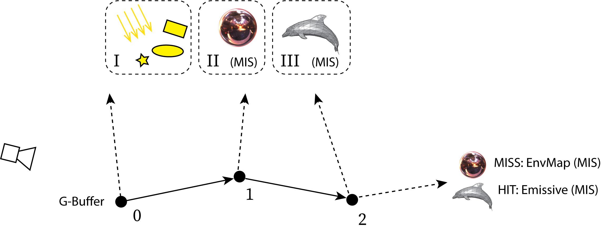

### [Index](../index.md) | [Usage](./index.md) | Path Tracer

--------

# Path Tracer

## Getting Started

1. Build Falcor
2. Launch Mogwai
3. The sample Path Tracer render graph file is located at `Source/Mogwai/Data/PathTracer.py`. There is also an alternative real-time denoised Path Tracer render graph at `Source/Mogwai/Data/PathTracerNRD.py`. You can load any one of them using any of the following methods:
    - Press `Ctrl + O` (or click `Load Script` in the top menu bar), then navigate to `PathTracer.py` or `PathTracerNRD.py`.
    - Drag and drop  `PathTracer.py` or `PathTracerNRD.py` into the application window.
    - Load script at startup using the Mogwai `--script` command line option.
4. Load a model or scene using one of the following methods. A sample scene is included, located at `media/Arcade/Arcade.pyscene`. Falcor can also load any format supported by Assimp as well as USD and pbrt-v4 scenes.
    - Press `Ctrl + Shift + O` (or click `Load Scene` in the top menu bar) then select a file.
    - Drag and drop a file into the application window.
    - Load scene at startup using the Mogwai `--scene` command line option.

## Overview



The `PathTracer` render pass implements an unbiased path tracer in DXR 1.1. Paths are generated in a full screen compute pass. A raygen shader then loops over path segments for each pixels up to the maximum configured path length. Shading is done in the hit/miss shader. Visibility rays are traced using ray queries (`TraceRayInline`).

For each pixel on screen, `samplesPerPixel` paths are traced. Typically this is set to `1` or a low number. Progressive rendering is achieved by feeding low-spp images to a subsequent `AccumulatePass` render pass.

At each path vertex (black dots), a visibility ray (dashed lines) is traced to sampled light sources. The sampling of a light is done by first randomly selecting one of up to three light sampling strategies (I: analytic lights, II: env map, III: mesh lights), followed by importance sampling using the chosen strategy. For (II) and (III), multiple importance sampling (MIS) is used.

Note: Direct illumination can alternatively be sampled using ReSTIR by enabling RTXDI.

The number of bounces is configured via the `maxSurfaceBounces`, `maxDiffuseBounces`, `maxSpecularBounces` and `maxTransmissionBounces` options. If set to `0`, only direct illumination is evaluated. If set to `1`, then 1-bounce indirect illumination is computed. Typically `maxTransmissionBounces` is set to a higher value (e.g. `10`) to allow tracing paths through multiple dielectric interfaces. The `maxDiffuseBounces` and `maxSpecularBounces` values are typically set lower (e.g. `3`) for improved performance. The `maxSurfaceBounces` is automatically determined as the maximum of the other three values.

Note that at the last path vertex, if the scene has emissive lights and/or MIS is enabled, a last ray is traced using BSDF sampling to avoid missing any direct illumination contribution to the last path vertex.

### Nested Dielectric Materials

Materials can be configured in a `.pyscene` file to be transmissive (glass, liquids etc).
To render such dielectric materials that are overlapping (e.g., liquid in a glass),
the meshes should be overlapping to avoid numerical issues and air gaps at the boundaries.
It is also important to make transmissive materials double-sided.

Falcor uses a stack-based method to resolve the priorities between such *nested dielectric* materials.
A material with a higher `nestedPriority` property takes precedence.

**Note:** The default value `nestedPriority = 0` is reserved to mean the highest possible priority.

Example of material configuration in a .pyscene file (see [Scripting](Scripting.md) for details on the Python API):

```python
# Absorption coefficients (or extinction coefficient in absence of scattering)
# From https://cseweb.ucsd.edu/~ravir/dilution.pdf and rescaled for Falcor scene units (meters)
volume_absorption = {
    'white_wine': float3(12.28758, 16.51818, 20.30273),
    'red_wine': float3(117.13133, 251.91133, 294.33867),
    'beer': float3(11.78552, 25.45862, 58.37241),
    'bottle_wine': float3(102.68063, 168.015, 246.80438)
}

# Configure the scene's existing materials for nested dieletrics.
glass = sceneBuilder.getMaterial("TransparentGlass")
glass.roughness = 0
glass.metallic = 0
glass.indexOfRefraction = 1.55
glass.specularTransmission = 1
glass.doubleSided = True
glass.nestedPriority = 5

bottle_wine = sceneBuilder.getMaterial("TransparentGlassWine")
bottle_wine.roughness = 0
bottle_wine.metallic = 0
bottle_wine.indexOfRefraction = 1.55
bottle_wine.specularTransmission = 1
bottle_wine.doubleSided = True
bottle_wine.nestedPriority = 5
bottle_wine.volumeAbsorption = volume_absorption['bottle_wine']

water = sceneBuilder.getMaterial("Water")
water.roughness = 0
water.metallic = 0
water.indexOfRefraction = 1.33
water.specularTransmission = 1
water.doubleSided = True
water.nestedPriority = 1

ice = sceneBuilder.getMaterial("Ice")
ice.roughness = 0.1
ice.metallic = 0
ice.indexOfRefraction = 1.31
ice.specularTransmission = 1
ice.doubleSided = True
ice.nestedPriority = 4
```

### Render Pass Inputs

The path tracer only requires a lightweight V-buffer as input. The V-buffer encodes just the hit mesh/primitive index and barycentrics. Based on those attributes, the path tracer fetches vertex and material data on primary hits.

There are optional inputs that are only used when certain features are enabled. The following is a list of all the inputs:

| Name | Optional | Description |
| --- | --- | --- |
| `vbuffer` | No | Encodes the primary hit points. |
| `mvec` | Yes | Motion vectors in screen-space (needed when enabling RTXDI for sampling direct illumination, otherwise temporal resampling will not work properly). |
| `viewW` | Yes | View direction in world-space (needed for correct rendering with depth-of-field, otherwise the view direction points towards the camera origin instead of the actual lens sample position). |
| `sampleCount` | Yes | Number of samples per pixel (for adaptive sampling). |

### Render Pass Outputs

All outputs of the path tracer render pass are optional and only computed if they are connected to subsequent render passes.

| Name | Format | Description|
| --- | --- | --- |
| `color` | `RGBA32Float` | Final radiance for each pixel. |
| `albedo` | `RGBA8Unorm`  | Diffuse albedo on primary hits. |
| `specularAlbedo` | `RGBA8Unorm`  | Specular albedo on primary hits. |
| `indirectAlbedo` | `RGBA8Unorm`  | Diffuse albedo (or emission) on secondary hits. |
| `normal` | `RGBA16Float` | Normal in world-space on primary hits. |
| `reflectionPosW` | `RGBA32Float` | Position in world-space on secondary hits. |
| `rayCount` | `R32Uint` | Number of rays traced per pixel, for debugging/visualization purposes. |
| `pathLength` | `R32Uint` | Path length per pixel, for debugging/visualization purposes. |
| `nrd*` | - | Many additional outputs for use with the NRD denoiser. |

## Sampling strategies

Note: Multiple importance sampling is applied to the strategies marked MIS.

### BSDF sampling (MIS)

- `StandardMaterial`:
  - Disney isotropic diffuse.
  - Trowbridge-Reitz GGX specular reflection/transmission with VNDF sampling.
  - Diffuse/specular reflection or transmission is chosen stochastically.
  - Ideal specular reflection/transmission when material roughness is near zero.

### Environment map sampling (MIS)

- A hierarchical importance map (mipmap) is computed at startup.
- Importance sampling by hierarchical warping of 2D uniform number.
- The PDF is proportional to incoming radiance, ignoring cosine term and visiblity.

### Emissive meshes light sampling (MIS)

- A light BVH is built over all emissive triangles.
- The per-triangle flux is pre-integrated and zero emissive triangles culled.
- Hierarchical importance sampling (see the book "Ray Tracing Gems", chapter 18).
- There are optional uniform and equal-power light sampling modes.

### Analytic light sampling

- Used for point, directional, distant, and quad/disc/sphere area lights.
- Lights are specified in the FBX file (point, directional) or Python scene file (.pyscene).
- Each light source is selected with equal probability.


## Validation/debugging tools

### MinimalPathTracer

- Separate `MinimalPathTracer` pass.
- Naive/simple to be easy to verify, no MIS etc.
- Produces ground truth images (but converges slowly).
- Does not support nested dielectric materials.

### ErrorMeasurePass

- Takes a source image and a reference image.
- The reference can either be loaded from disk, or taken from a pass input.
- Makes it possible to run two separate configs in parallel, compare their output.

### Shader print/assert

- The `PathTracer` pass supports debugging with `print()` in the shader.
- Click *Pixel Debug* in the UI to enable, click on a pixel to show it's output.
- It's useful to freeze the random seed (UI option) to avoid flickering values.
- There is also an `assert()` call that prints the coordinates of triggered asserts.
- The debug message are both shown in the UI and in the console.
