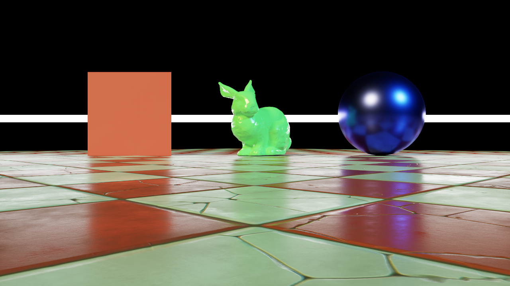

### [Index](../index.md) | [Usage](./index.md) | Scene Formats

--------

# Scene Formats

## USD Scene Files

Starting with version 5.0 Falcor includes an experimental importer for Universal Scene Description (USD) files.

The `UsdPreviewSurface` material model is partially supported by mapping to Falcor's `StandardMaterial` at load time.

## FBX/GLTF Scene Files

Falcor uses [Assimp](https://github.com/assimp/assimp) as its asset loader for FBX and GLTF scenes. It can load all other file formats Assimp supports by default, but support may be more limited.

All loaded material data is mapped to Falcor's `StandardMaterial` at load time.

From assets, Falcor will import:
- Scene Graph
- Meshes
- Materials
    - Diffuse Texture
        - Metal-Rough Shading Model (Default)
            - RGB: Base Color
            - A: Opacity (alpha)
        - Spec-Gloss Shading Model (Default for OBJ only)
            - RGB: Diffuse Color
            - A: Opacity (alpha)
    - Specular Parameters Texture
        - Metal-Rough Shading Model (Default)
            - R: Occlusion (unsupported)
            - G: Roughness
            - B: Metallic
        - Spec-Gloss Shading Model (Default for OBJ only)
            - RGB: Specular Color
            - A: Glossiness
    - Normals Texture
    - Emissive Color/Texture
- Cameras
- Point lights
- Directional lights
- Keyframe animations
- Skinned animations


## Python Scene Files

You can also leverage Falcor's scripting system to build scenes. This can be useful for building simple scenes from scratch as well as modifying existing assets (e.g. change material properties, add lights etc.) at load time. Python scene files are using the `.pyscene` file extension.

### Basic Usage

When a Python scene file is executed, the script has access to a global variable `sceneBuilder` of type `SceneBuilder`. As the name suggests, the `SceneBuilder` class is used to build the scene. For a full reference see the [scripting documentation](./Scripting.md).

A very basic Python scene file might just load an asset:

```python
# Load asset
sceneBuilder.importScene('BistroInterior.fbx')
```

If nothing else is added to the script, this will behave the same as loading `BistroInterior.fbx` directly. However, we can do more. For example, let's add an environment map:

```python
# Create environment map
envMap = EnvMap('envmap.hdr')
envMap.intensity = 2.0
sceneBuilder.envMap = envMap
```

We can also change properties of existing materials in `BistroInterior.fbx`:

```python
# Change glass material
m = sceneBuilder.getMaterial('Glass')
m.specularTransmission = 1.0
m.indexOfRefraction = 1.52
```

We can add a new light source:

```python
# Create directional light
light = DirectionalLight('DirLight0')
light.intensity = float3(3.0, 2.0, 3.0)
light.direction = float3(0.0, -1.0, 0.0)
sceneBuilder.addLight(light)
```

We can add a new camera and select it:

```python
# Create camera
camera = Camera('Camera0')
camera.position = float3(0.0, 1.0, 10.0)
camera.target = float3(0.0, 1.0, 0.0)
camera.up = float3(0.0, 1.0, 0.0)
camera.focalLength = 50.0
sceneBuilder.addCamera(camera)
sceneBuilder.selectedCamera = camera
```

### Advanced Usage

Besides modifying and extending existing scenes, Python scene files can also be used to create scenes procedurally. This can be useful for debugging, but is not meant as a replacement for the importers loading larger assets. Load performance and functionality is limited.

#### Create Geometry

We start by creating some geometry:

```python
# Create triangle meshes
quadMesh = TriangleMesh.createQuad()
cubeMesh = TriangleMesh.createCube()
sphereMesh = TriangleMesh.createSphere()
```

This creates simple triangle meshes of standard primitives. You can also create a triangle mesh from loading a file, for example from a Wavefront OBJ:

```python
# Create triangle mesh from a file
bunnyMesh = TriangleMesh.createFromFile('Bunny.obj')
```

Note that `TriangleMesh` does not know about materials and only geometry is loaded from the file. We will define materials later.

As a last option, you can also create triangle meshes completely from scratch:

```python
# Create triangle mesh from scratch
customMesh = TriangleMesh()
normal = float3(0, 1, 0)
customMesh.addVertex(float3(-10, 0, -10), normal, float2(0, 0))
customMesh.addVertex(float3(10, 0, -10), normal, float2(5, 0))
customMesh.addVertex(float3(-10, 0, 10), normal, float2(0, 5))
customMesh.addVertex(float3(10, 0, 10), normal, float2(5, 5))
customMesh.addTriangle(2, 1, 0)
customMesh.addTriangle(1, 2, 3)
```

Each vertex has a _position_, _normal_ and _texCoord_ attribute. Triangles are defined by indexing the vertices.

#### Create Materials

Next we need to define at least one material to use for our meshes.
For more examples, see [Materials](./Materials.md).

```python
# Create materials
red = StandardMaterial('Red')
red.baseColor = float4(0.8, 0.1, 0.1, 1.0)
red.roughness = 0.3

green = StandardMaterial('Green')
green.baseColor = float4(0.1, 0.8, 0.1, 1.0)
green.roughness = 0.2
green.emissiveColor = float3(1, 1, 1)
green.emissiveFactor = 0.1

blue = StandardMaterial('Blue')
blue.baseColor = float4(0.1, 0.1, 0.8, 1.0)
blue.roughness = 0.3
blue.metallic = 1

emissive = StandardMaterial('Emissive')
emissive.baseColor = float4(1, 1, 1, 1)
emissive.roughness = 0.2
emissive.emissiveColor = float3(1, 1, 1)
emissive.emissiveFactor = 20
```

We can also create materials using textures:

```python
# Create material with textures
floor = StandardMaterial('Floor')
floor.loadTexture(MaterialTextureSlot.BaseColor, 'Arcade/Textures/CheckerTile_BaseColor.png')
floor.loadTexture(MaterialTextureSlot.Specular, 'Arcade/Textures/CheckerTile_Specular.png')
floor.loadTexture(MaterialTextureSlot.Normal, 'Arcade/Textures/CheckerTile_Normal.png')
```

#### Building Scene

With some geometry and a materials at hand, we can now register meshes to the scene builder:

```python
# Add meshes to scene builder
quadMeshID = sceneBuilder.addTriangleMesh(quadMesh, red)
cubeMeshID = sceneBuilder.addTriangleMesh(cubeMesh, emissive)
sphereMeshID = sceneBuilder.addTriangleMesh(sphereMesh, blue)
bunnyMeshID = sceneBuilder.addTriangleMesh(bunnyMesh, green)
customMeshID = sceneBuilder.addTriangleMesh(customMesh, floor)
```

Each call to `addTriangleMesh()` returns a new ID that uniquely identifies the mesh and assigned material.

Next, we need to create some scene graph nodes:

```python
# Add scene graph to scene builder
quadNodeID = sceneBuilder.addNode('Quad', Transform(scaling=2, translation=float3(-3, 1, 0), rotationEulerDeg=float3(90, 0, 0)))
cubeNodeID = sceneBuilder.addNode('Cube', Transform(scaling=float3(15, 0.2, 0.2), translation=float3(0, 1, -2)))
sphereNodeID = sceneBuilder.addNode('Sphere', Transform(scaling=1, translation=float3(3, 1, 0)))
customNodeID = sceneBuilder.addNode('Custom', Transform(scaling=1, rotationEulerDeg=float3(0, 45, 0)))
bunnyNodeID = sceneBuilder.addNode('Bunny', Transform(scaling=12, translation=float3(0.3, -0.4, 0)), customNodeID)
```

Each call to `addNode()` returns a new ID that uniquely identifies the node. By using the (optional) last argument in `addNode()`, we can attach nodes to a parent node and build a scene hierarchy.

The `Transform` class is used to describe the relative transformation of the scene node. When constructing a `Transform`, we can directly pass in `translation`, `scaling`, `rotationEuler` or `rotationEulerDeg`. Alternatively we can create _look-at_ transformations using `position`, `target` and `up`.

With a basic scene graph in place, we can attach mesh instances to it:

```python
# Add mesh instances to scene graph
sceneBuilder.addMeshInstance(quadNodeID, quadMeshID)
sceneBuilder.addMeshInstance(cubeNodeID, cubeMeshID)
sceneBuilder.addMeshInstance(sphereNodeID, sphereMeshID)
sceneBuilder.addMeshInstance(bunnyNodeID, bunnyMeshID)
sceneBuilder.addMeshInstance(customNodeID, customMeshID)
```

As in the basic example, we obviously should also add a camera and at least one light source to make the scene renderable.

```python
# Add camera
camera = Camera('Camera')
camera.position = float3(0, 0.3, 10)
camera.target = float3(0, 0.3, 0)
camera.up = float3(0, 1, 0)
camera.focalLength = 35
sceneBuilder.addCamera(camera)

# Add lights
light0 = DistantLight('Light0')
light0.direction = float3(1, -1, -1)
light0.intensity = float3(5, 5, 1)
light0.angle = 0.1
sceneBuilder.addLight(light0)

light1 = DistantLight('Light1')
light1.direction = float3(-1, -1, -1)
light1.intensity = float3(1, 5, 5)
light1.angle = 0.1
sceneBuilder.addLight(light1)
```

With all of this in place, we can render our scene and get the following image:



Additional examples of Python scene can be found in the `media/TestScenes` folder.
